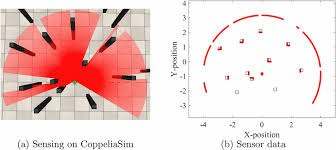
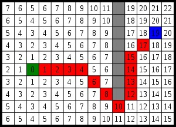

# Multisensor Navigation System for Autonomous Robots

A CoppeliaSim-based robot navigation project that integrates LiDAR sensing, vision sensing and processing, and A-star pathfinding for autonomous robot navigation.

## Video(GIFs)


## Team Members and Roles

- Halasyam Visvanathan (Primary Developer - A-Star Path Planning)
- Amos Langsner (Primary Developer - Vision Sensing)
- Abigail Todd (Primary Developer - Environment Building and Depth Sensing)
- Junsu Lee (Primary Developer - Integration)

## Introduction

### Motivation

The motivation behind this project is to investigate how autonomous robots can reliably navigate complex, uncertain environments, which is an essential capability for real-world applications, especially with the rise of autonomous robots in our society, on the road, in warehouses, and in as search-and-rescue operations.


### ECSE275 Robotics Concepts

- A-Star algorithm path planning
- LiDAR sensing
- Vision sensing and processing
- Differential drive robots
- Creating simulations in CopelliaSIM
- Python coding

### Deliverable

The final deliverable is a team of differential-drive robots that collaboratively explore an unknown environment using LiDAR and vision sensing to detect obstacles, classify terrain, assign traversal costs, and build a shared map. Using this continuously updated map, the robots exchange information and dynamically replan their routes with A-Star to reach their goal locations.

## Approach

### Building Blocks

- **LiDAR Processing**
  - FastHokuyo LiDAR data acquisition
  - Obstacle detection and clustering
  - Sensor-to-world coordinate transformation



- **Vision Sensor Processing**
  - RGB image capture and processing (256×256 resolution)
  - Depth map extraction and conversion
  - Color-based object detection (red, green, blue)
  - Centroid calculation from color masks
  - Pixel-to-robot-to-world coordinate transformation

- **Terrain Mapping**
  - Dynamic map creation with configurable resolution
  - Multiple terrain types (floor, grass, sand, water, obstacle)
  - Terrain cost assignment for pathfinding
  - Real-time map updates based on sensor data
 


- **A* Pathfinding**
  - 4-connected grid navigation
  - Terrain-aware cost function
  - Euclidean distance heuristic
  - World-to-map coordinate conversion



### Implementation

#### File Structure

```
Version_8/
├── Final_project_main.py          # Main execution script
├── FP_funcs.py                    # Core function library
├── Verision_8.txt                 # Project notes
├── final_project.ttt              # CoppeliaSim scene file
└── __pycache__/                   # Python cache directory
```

#### Dependencies

- **Python Libraries:**
  - `numpy` - Numerical computations and array operations
  - `matplotlib` - Image visualization
  - `math` - Mathematical operations
  - `heapq` - Priority queue for A* algorithm

- **CoppeliaSim:**
  - `coppeliasim_zmqremoteapi_client` - ZMQ Remote API for CoppeliaSim communication

#### Installation

1. Install Python dependencies:
```bash
pip install numpy matplotlib
```

2. Install CoppeliaSim and the ZMQ Remote API:
   - Download CoppeliaSim from [https://www.coppeliarobotics.com/](https://www.coppeliarobotics.com/)
   - Install the ZMQ Remote API client

3. Activate your conda environment:
```bash
conda activate ecse275env
```

#### Usage

1. **Start CoppeliaSim** and load the scene file `final_project (1).ttt`

2. **Run the main script:**
```bash
python Final_project_main.py
```

3. The system will:
   - Establish connection to CoppeliaSim
   - Initialize sensors (LiDAR and vision)
   - Process sensor data
   - Detect objects and obstacles
   - Build terrain map
   - Display processed images

#### Main Script (`Final_project_main.py`)

- Establishes ZMQ connection to CoppeliaSim
- Initializes robot, sensors, and goal position
- Processes LiDAR data for obstacle detection
- Captures and processes RGB and depth images
- Performs color-based object detection
- Transforms coordinates between sensor and world frames

#### Function Library (`FP_funcs.py`)

#### Vision Processing Functions
- `process_vision_Sensor_RBG()` - Extract RGB images
- `process_vision_sensor_depth()` - Extract depth maps
- `compute_pos_from_pix()` - Convert pixel coordinates to 3D positions
- `mask_color()` - Create binary mask for target color
- `centroid_from_mask()` - Calculate centroid of detected objects
- `depth_from_rgb_mask()` - Extract depth values from masked regions

#### LiDAR Processing Functions
- `process_Lidar_depth()` - Process LiDAR measurements
- `segment_lidar()` - Segment point cloud based on distance threshold
- `transform_point()` - Transform points using transformation matrix

#### Mapping Functions
- `createMap_withResolution()` - Initialize terrain map
- `Update_map()` - Update map with detected terrain objects
- `Convert_world_to_map()` - World to map coordinate conversion
- `Convert_map_to_world()` - Map to world coordinate conversion

#### Pathfinding Functions
- `astar()` - A* pathfinding algorithm implementation
- `heuristic()` - Euclidean distance calculation
- `get_neighbors()` - Get valid neighboring cells
- `a_star_path_to_coppelia_points()` - Convert path to CoppeliaSim format

#### Terrain System
- `terrain` class - Represents map cells with terrain properties
- `TerrainType` enum - Defines terrain types and costs
  - Floor: cost 0
  - Grass: cost 2
  - Sand: cost 4
  - Water: cost 8
  - Obstacle: cost ∞

#### Map Resolution
Default resolution is 100×100 cells covering a 10×10 meter world:
```python
Resolution = 100
R = 10/Resolution  # Cell size = 0.1m
```

#### Sensor Parameters
- **Vision Sensor:** 256×256 pixels, 60° FOV
- **LiDAR:** FastHokuyo with segmentation threshold of 0.2m

#### Color Detection
Adjust color threshold in `mask_color()` function (default: 20-point margin)

#### Algorithms

#### A* Pathfinding
- **Graph:** 4-connected grid
- **Cost Function:** g(n) = movement_cost + terrain_cost
- **Heuristic:** h(n) = Euclidean distance to goal
- **Priority:** f(n) = g(n) + h(n)

#### LiDAR Segmentation
Groups consecutive points if distance < threshold, separating distinct objects


### Experiments and Data

What experiments did you conduct and what data did you gather to measure the performance
of the system or define success? Include a summary flow chart of how different components in your
implementation interface with each other. What messages or data is passed between components?


## Future Enhancements

1. **Multi-Robot System**
   - Coordinate multiple robots
   - Dynamic task allocation
   - Shared map updates

2. **Advanced Perception**
   - Real-time obstacle avoidance
   - Dynamic object tracking
   - Improved terrain classification

3. **Optimized Planning**
   - Dynamic path replanning
   - Multi-robot path coordination
   - Adaptive map resolution

## Troubleshooting

### Connection Issues
- Ensure CoppeliaSim is running before executing the script
- Verify ZMQ Remote API is properly installed
- Check that scene contains required objects with correct names

### Coordinate System
- All transformations use CoppeliaSim's 3×4 transformation matrices
- World frame origin is at (0, 0, 0)
- Map assumes world center at map center

### Pathfinding
- Verify start and goal positions are not obstacles
- Check map resolution matches world size
- Ensure terrain costs are properly set
