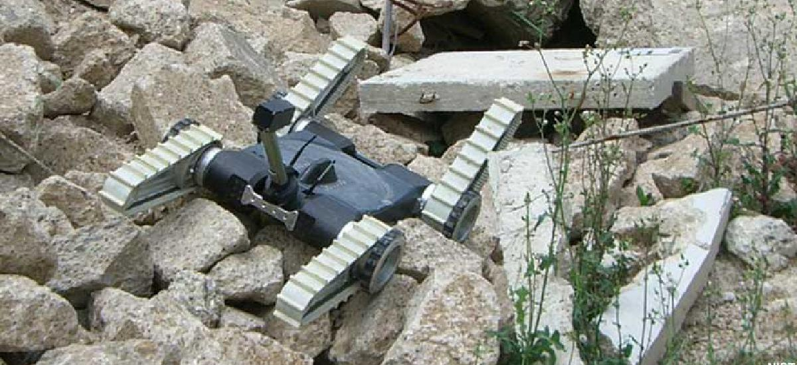
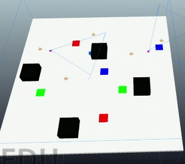
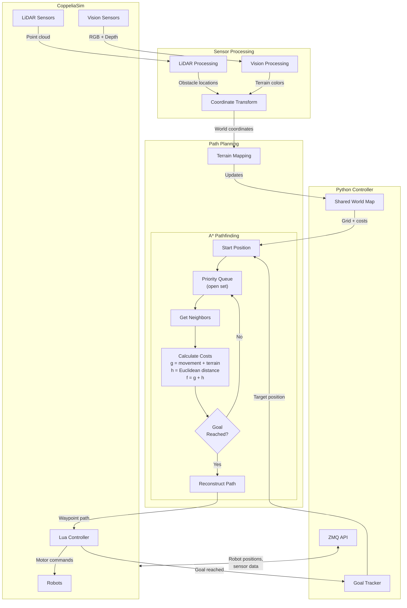
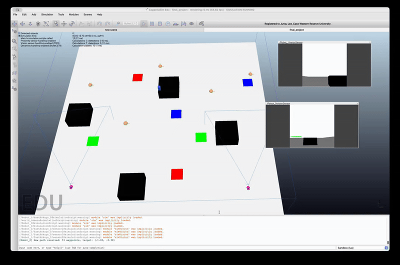

# Multisensor Navigation System for Autonomous Robots

A CoppeliaSim-based project that integrates LiDAR sensing, vision sensing and processing, and A-Star pathfinding for autonomous robot navigation.

## Team Members and Roles

- Halasyam Visvanathan
  - Designed and implemented the A-Star path planning algorithm
  - Developed the dynamic re-planning and integrated obstacle updates
  - Performed testing to validate path efficiency and correctness
- Amos Langsner
  - Developed vision-based detection and terrain classification
  - Integrated sensing data into mapping
  - Contributed to the project write-up and documentation
- Abigail Todd
  - Built the simulated environment
  - Developed LiDAR sensing and integrated into mapping
  - Contributed to the project write-up and documentation
- Junsu Lee
  - Integrated sensing, mapping, and path-planning for multi-robot system
  - Coordinated inter-robot behavior and communication
  - Performed end-to-end system testing and debugging

## Introduction

### Motivation

The motivation behind this project is to investigate how autonomous robots can reliably navigate complex, uncertain environments, which is an essential capability for real-world applications, especially with the rise of autonomous robots in our society, on the road, in warehouses, and in search-and-rescue operations.



### ECSE 275 Robotics Concepts Explored in This Project

- A-Star algorithm path planning
- LiDAR sensing
- Vision sensing and processing
- Differential drive robots
- Simulations in CopelliaSIM
- Python coding

### Deliverable

The final deliverable is a team of differential-drive robots that collaboratively explore an unknown environment using LiDAR and vision sensing to detect obstacles, classify terrain, assign traversal costs, and build a shared map. Using this continuously updated map, the robots exchange information and dynamically replan their routes with A-Star to reach their goal locations.

## Approach

### Building Blocks

- **LiDAR Processing**
  - FastHokuyo LiDAR data acquisition
  - Obstacle detection and clustering
  - Robot-to-world coordinate transformation


- **Vision Sensor Processing**
  - RGB image capture and processing (256×256 resolution)
  - Color-based object detection (red, green, blue)
  - Centroid calculation from color masks
  - Pixel-to-robot-to-world coordinate transformation

- **Environment Mapping**
  - Dynamic map creation with configurable resolution
  - Classification of terrain types (floor, grass, sand, water) and obstacles
  - Assignment of traversal costs for pathfinding
  - Real-time map updates based on sensor data



- **A-Star Pathfinding**
  - 4-connected grid navigation
  - Terrain-aware cost function
  - Euclidean distance heuristic
  - World-to-map coordinate conversion


### Implementation

#### File Structure

```
ecse275-final-astar-search/
├── Final_project_main.py          # Main execution script
├── FP_funcs.py                    # Core function library
├── config.py                      # Centralized configuration
├── final_project.ttt              # CoppeliaSim scene file
└── coppeliasim_script/            # Lua scripts for robots
```

#### Dependencies

- **Python Libraries:**

  - `numpy` - Numeric operations, masks, arrays, LiDAR processing
  - `matplotlib` - Plotting, debug visualizations
  - `coppeliasim-zmqremoteapi-client` -  ZMQ Remote API for communication with CoppeliaSim

- **CoppeliaSim:**
  - ZMQ Remote API

#### Installation

1. Install Python dependencies:

```bash
pip install numpy matplotlib coppeliasim-zmqremoteapi-client
```

2. Install CoppeliaSim and the ZMQ Remote API:

   - Download CoppeliaSim from [https://www.coppeliarobotics.com/](https://www.coppeliarobotics.com/)
   - Install the ZMQ Remote API client

3. Activate your conda environment:

```bash
conda activate ecse275env
```

#### Usage

1. **Start CoppeliaSim** and load the scene file `final_project.ttt`

2. **Run the main script:**

```bash
python Final_project_main.py
```

3. The system will:
   - Establish connection to CoppeliaSim
   - Initialize sensors (LiDAR and vision)
   - Process sensor data
   - Detect obstacles and terrain
   - Build map
   - Display processed images

- **Main Script (`Final_project_main.py`)**
  - Establishes ZMQ connection to CoppeliaSim
  - Initializes robot, sensors, and goal position
  - Calls functions for LiDAR processing and RGB image capture for object and terrain detection
  - Calls functions to handle coordinate transformations
  - Integrates path planning, sensing, and mapping into the simulation loop

- **Functions Library (`FP_funcs.py`)**
  - **Vision Processing Functions**
    - `process_vision_Sensor_RBG()` - Extract RGB images
    - `process_vision_sensor_depth()` - Extract depth maps
    - `compute_pos_from_pix()` - Convert pixel coordinates to 3D positions
    - `mask_color()` - Create binary mask for target color
    - `centroid_from_mask()` - Calculate centroid of detected objects
    - `depth_from_rgb_mask()` - Extract depth values from masked regions
  - **LiDAR Processing Functions**
    - `process_Lidar_depth()` - Process LiDAR measurements
    - `segment_lidar()` - Segment point cloud based on distance threshold
    - `transform_point()` - Transform points using transformation matrix
  - **Mapping Functions**
    - `createMap_withResolution()` - Initialize terrain map
    - `Update_map()` - Update map with detected terrain objects
    - `Convert_world_to_map()` - World to map coordinate conversion
    - `Convert_map_to_world()` - Map to world coordinate conversion
  - **Pathfinding Functions**
    - `astar()` - A\* pathfinding algorithm implementation
    - `heuristic()` - Euclidean distance calculation
    - `get_neighbors()` - Get valid neighboring cells (4 or 8 connected)
    - `get_neighbors_4connected()` - Get cardinal neighbors (up/down/left/right)
    - `get_neighbors_8connected()` - Get all neighbors including diagonals
    - `has_line_of_sight()` - Check clear path between two cells (Bresenham's algorithm)
    - `smooth_path()` - Remove unnecessary waypoints using line-of-sight
    - `smooth_path_with_terrain()` - Smooth path while avoiding high-cost terrain
- **Terrain System**
  - `terrain` class - Represents map cells with terrain properties
  - `TerrainType` enum - Defines terrain types and costs
   - Floor: cost 0
    - Grass: cost 2
    - Sand: cost 4
    - Water: cost 8
    - Obstacle: cost ∞
- **Map Resolution**
  - Default resolution is 100×100 cells covering a 10×10 meter world:
```python
Resolution = 100
R = 10/Resolution  # Cell size = 0.1m
```
- **Sensor Parameters**
  - LiDAR: FastHokuyo with segmentation threshold of 0.2m
  - Vision Sensor: 256×256 pixels, 60° field of vision
- **Color Detection**
  - Adjust color threshold in `mask_color()` function (default: 20-point margin)
- **Algorithms**
  - **A-Star Pathfinding**
    - Graph: 4-connected grid
    - Cost Function: g(n) = movement_cost + terrain_cost
    - Heuristic: h(n) = Euclidean distance to goal
    - Priority: f(n) = g(n) + h(n)
  - **LiDAR Segmentation**
    - Groups consecutive points if distance < threshold, separating distinct objects

### Summary Flow Chart

The following diagram illustrates how different components in the implementation interface with each other, showing the data flow and messages passed between them:



### Testing to Measure Performance

**Variable Field-of-View (FOV)**
Three trials were conducted under two different camera FOV settings: 60° and 120°. For each trial, the time to reach the first goal and the time to reach all goals were recorded. This data quantified the impact of FOV on navigation efficiency and overall system performance, identifying an optimal FOV. 

**Variable Map Resolution**
Navigation performance and A-Star pathfinding reliability were evaluated across map resolutions ranging from 25×25 to 500×500 cells. Resolution determines the size of cells in the occupancy grid:

- Very low resolutions reduce computational cost but can oversimplify the environment, causing imprecise obstacle representation.
- Higher resolutions create finer grids, allowing more precise representation of obstacles.
- Extremely high resolutions produce cells smaller than the robot’s physical dimensions, which can lead to path-tracking errors and potential collisions.

This test helped identify an optimal resolution that balances map detail with reliable navigation performance.

## Results



### Data

**Variable Field-of-View (FOV) Test**

FOV = 60

| Test | Time to First Goal (s) | Time to All Goals (s) |
| ---- | ---------------------- | --------------------- |
| 1    | 44.04                  | 63.4                  |
| 2    | 43.07                  | 64.5                  |
| 3    | 45.23                  | 62.5                  |

FOV = 120

| Test | Time to First Goal (s) | Time to All Goals (s) |
| ---- | ---------------------- | --------------------- |
| 1    | 43.24                  | 72.97                 |
| 2    | 40.75                  | 70.47                 |
| 3    | 43.64                  | 72.54                 |

**Variable Map Resolution Test**

| Resolution | Cell Size (m) | Grid Cells | Time (s)         |
| ---------- | ------------- | ---------- | ---------------- |
| 25         | 0.4           | 625        | 42               |
| 50         | 0.2           | 2,500      | 45               |
| 100        | 0.1           | 10,000     | 43               |
| 150        | ~0.067        | 22,500     | 42               |
| 250        | 0.04          | 62,500     | 43               |
| 500        | 0.02          | 250,000    | Failed to search |

### Success

Overall, our implementation was successful. The system is able to detect obstacles and different terrain types, dynamically update A-Star paths, communicate shared maps between robots, and successfully navigate to the designated goals.

#### Troubleshooting

#### Connection Issues

- Ensure CoppeliaSim is running before executing the script
- Verify ZMQ Remote API is properly installed
- Check that scene contains required objects with correct names

#### Coordinate System

- All transformations use CoppeliaSim's 3×4 transformation matrices
- World frame origin is at (0, 0, 0)
- Map assumes world center at map center

#### Pathfinding

- Verify start and goal positions are not obstacles
- Check map resolution matches world size
- Ensure terrain costs are properly set

## Conclusion

The simulation successfully integrates LiDAR and vision sensing to gather environmental data and construct a map. A team of robots utilize a dynamic A-Star algorithm to plan paths and efficiently reach their goals, demonstrating coordinated navigation and adaptability within the environment. While additional validation and testing is necessary, this demonstration supports the argument for the use of multiple coordinated mobile robots as an efficient way to rapidly explore an environment and construct a map.

### Future Enhancements

1. **Multi-Robot System**

   - Coordinate 3, 4, 5 robots
   - Dynamic task allocation
   - Shared map updates

2. **Advanced Perception**

   - Dynamic object tracking (track object velocity and acceleration)
   - Improved terrain classification (edge detection)

3. **Increased environment complexity**
   - Larger obstacle variety
   - Increased map resolution
   - Dynamic objects
