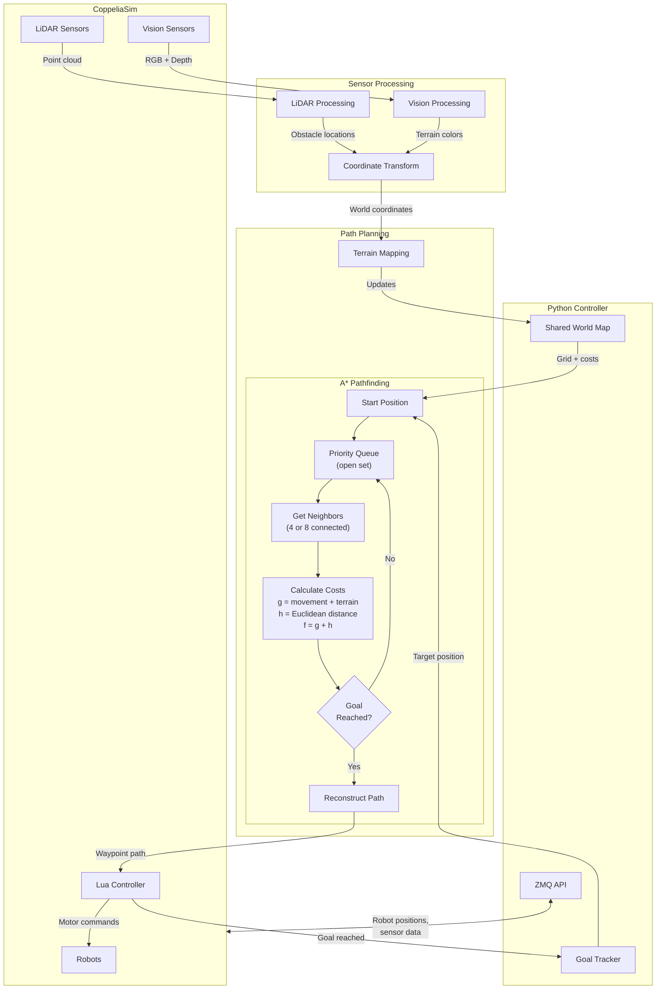

# Multisensor Navigation System for Autonomous Robots

A CoppeliaSim-based robot navigation project that integrates LiDAR sensing, vision sensing and processing, and A-Star pathfinding for autonomous robot navigation.

## Team Members and Roles

- Halasyam Visvanathan (Primary Developer - A-Star Path Planning, Testing)
- Amos Langsner (Primary Developer - Vision Sensing, Write-up)
- Abigail Todd (Primary Developer - Environment Building and Depth Sensing, Write-up)
- Junsu Lee (Primary Developer - Integration, Testing)

## Introduction

### Motivation

The motivation behind this project is to investigate how autonomous robots can reliably navigate complex, uncertain environments, which is an essential capability for real-world applications, especially with the rise of autonomous robots in our society, on the road, in warehouses, and in as search-and-rescue operations.


### ECSE275 Robotics Concepts

- A-Star algorithm path planning
- LiDAR sensing
- Vision sensing and processing
- Differential drive robots
- Creating simulations in CopelliaSIM
- Python coding

### Deliverable

The final deliverable is a team of differential-drive robots that collaboratively explore an unknown environment using LiDAR and vision sensing to detect obstacles, classify terrain, assign traversal costs, and build a shared map. Using this continuously updated map, the robots exchange information and dynamically replan their routes with A-Star to reach their goal locations.

## Approach

### Building Blocks

- **LiDAR Processing**
  - FastHokuyo LiDAR data acquisition
  - Obstacle detection and clustering
  - Sensor-to-world coordinate transformation


- **Vision Sensor Processing**

  - RGB image capture and processing (256×256 resolution)
  - Depth map extraction and conversion
  - Color-based object detection (red, green, blue)
  - Centroid calculation from color masks
  - Pixel-to-robot-to-world coordinate transformation

- **Terrain Mapping**
  - Dynamic map creation with configurable resolution
  - Multiple terrain types (floor, grass, sand, water, obstacle)
  - Terrain cost assignment for pathfinding
  - Real-time map updates based on sensor data


- **A\* Pathfinding**
  - 4-connected grid navigation
  - Terrain-aware cost function
  - Euclidean distance heuristic
  - World-to-map coordinate conversion


### Implementation

#### File Structure

```
ecse275-final-astar-search/
├── Final_project_main.py          # Main execution script
├── FP_funcs.py                    # Core function library
├── config.py                      # Centralized configuration
├── final_project.ttt              # CoppeliaSim scene file
└── coppeliasim_script/            # Lua scripts for robots
```

#### Dependencies

- **Python Libraries:**

  - `numpy` - Numeric operations, masks, arrays, LiDAR processing
  - `matplotlib` - Plotting, debug visualizations
  - `coppeliasim-zmqremoteapi-client` -  ZMQ Remote API for communication with CoppeliaSim

- **CoppeliaSim:**
  - ZMQ Remote API

#### Installation

1. Install Python dependencies:

```bash
pip install numpy matplotlib coppeliasim-zmqremoteapi-client
```

2. Install CoppeliaSim and the ZMQ Remote API:

   - Download CoppeliaSim from [https://www.coppeliarobotics.com/](https://www.coppeliarobotics.com/)
   - Install the ZMQ Remote API client

3. Activate your conda environment:

```bash
conda activate ecse275env
```

#### Usage

1. **Start CoppeliaSim** and load the scene file `final_project.ttt`

2. **Run the main script:**

```bash
python Final_project_main.py
```

3. The system will:
   - Establish connection to CoppeliaSim
   - Initialize sensors (LiDAR and vision)
   - Process sensor data
   - Detect objects and obstacles
   - Build terrain map
   - Display processed images

#### Main Script (`Final_project_main.py`)

- Establishes ZMQ connection to CoppeliaSim
- Initializes robot, sensors, and goal position
- Processes LiDAR data for obstacle detection
- Captures and processes RGB and depth images
- Performs color-based object detection
- Transforms coordinates between sensor and world frames

#### Function Library (`FP_funcs.py`)

#### Vision Processing Functions

- `process_vision_Sensor_RBG()` - Extract RGB images
- `process_vision_sensor_depth()` - Extract depth maps
- `compute_pos_from_pix()` - Convert pixel coordinates to 3D positions
- `mask_color()` - Create binary mask for target color
- `centroid_from_mask()` - Calculate centroid of detected objects
- `depth_from_rgb_mask()` - Extract depth values from masked regions

#### LiDAR Processing Functions

- `process_Lidar_depth()` - Process LiDAR measurements
- `segment_lidar()` - Segment point cloud based on distance threshold
- `transform_point()` - Transform points using transformation matrix

#### Mapping Functions

- `createMap_withResolution()` - Initialize terrain map
- `Update_map()` - Update map with detected terrain objects
- `Convert_world_to_map()` - World to map coordinate conversion
- `Convert_map_to_world()` - Map to world coordinate conversion

#### Pathfinding Functions

- `astar()` - A\* pathfinding algorithm implementation
- `heuristic()` - Euclidean distance calculation
- `get_neighbors()` - Get valid neighboring cells (4 or 8 connected)
- `get_neighbors_4connected()` - Get cardinal neighbors (up/down/left/right)
- `get_neighbors_8connected()` - Get all neighbors including diagonals
- `has_line_of_sight()` - Check clear path between two cells (Bresenham's algorithm)
- `smooth_path()` - Remove unnecessary waypoints using line-of-sight
- `smooth_path_with_terrain()` - Smooth path while avoiding high-cost terrain


#### Terrain System

- `terrain` class - Represents map cells with terrain properties
- `TerrainType` enum - Defines terrain types and costs
  - Floor: cost 0
  - Grass: cost 2
  - Sand: cost 4
  - Water: cost 8
  - Obstacle: cost ∞

#### Map Resolution

Default resolution is 100×100 cells covering a 10×10 meter world:

```python
Resolution = 100
R = 10/Resolution  # Cell size = 0.1m
```

#### Sensor Parameters

- **Vision Sensor:** 256×256 pixels, 60° FOV
- **LiDAR:** FastHokuyo with segmentation threshold of 0.2m

#### Color Detection

Adjust color threshold in `mask_color()` function (default: 20-point margin)

#### Algorithms

#### A\* Pathfinding

- **Graph:** 4-connected grid
- **Cost Function:** g(n) = movement_cost + terrain_cost
- **Heuristic:** h(n) = Euclidean distance to goal
- **Priority:** f(n) = g(n) + h(n)

#### LiDAR Segmentation

Groups consecutive points if distance < threshold, separating distinct objects

### Testing

1. Variable Field-of-View (FOV)
   We conducted three trials under two different camera field-of-view settings: 60° and 120°. In each trial, we recorded the time taken to reach the first goal and the time taken to reach all goals. This data allowed us to quantify how FOV impacts navigation efficiency and overall system performance.

2. Variable Map Resolution
   We tested how map resolution affects navigation performance and A\* pathfinding reliability. Resolution determines the cell size of the occupancy grid—higher resolutions create finer grids with smaller cells. While finer grids can represent obstacles more precisely, extremely high resolutions (like 500) cause the cell size to become smaller than the robot's physical dimensions, leading to path tracking errors and collisions.
   (here)

### Summary Flow Chart

The following diagram illustrates how different components in the implementation interface with each other, showing the data flow and messages passed between modules:



#### Key Data Flows:

| Source            | Destination       | Data/Message                             |
| ----------------- | ----------------- | ---------------------------------------- |
| LiDAR Sensor      | LiDAR Processing  | 3D point cloud (x, y, z)                 |
| Vision Sensor     | Vision Processing | RGB image + depth buffer                 |
| Sensor Processing | Terrain Mapping   | World coordinates of obstacles & terrain |
| Terrain Mapping   | A\* Pathfinding   | Grid map with terrain costs              |
| A\* Pathfinding   | Lua Controller    | Waypoint path [(x, y), ...]              |
| Lua Controller    | Goal Tracker      | Goal completion status                   |

#### A\* Pathfinding Details:

| Component          | Description                                                                      |
| ------------------ | -------------------------------------------------------------------------------- |
| **Priority Queue** | Min-heap ordered by f-cost, stores nodes to explore                              |
| **g-cost**         | Actual cost from start: movement cost (1.0 cardinal, √2 diagonal) + terrain cost |
| **h-cost**         | Heuristic: Euclidean distance to goal                                            |
| **f-cost**         | Total estimated cost: f = g + h                                                  |
| **Neighbors**      | 4-connected (up/down/left/right) or 8-connected (includes diagonals)             |
| **Terrain Costs**  | Floor: 0, Grass: 2, Sand: 4, Water: 8, Obstacle: ∞                               |

## Results


### Data

1. Variable Field-of-View (FOV)

FOV = 60

| Test | Time to First Goal (s) | Time to All Goals (s) |
| ---- | ---------------------- | --------------------- |
| 1    | 44.04                  | 63.4                  |
| 2    | 43.07                  | 64.5                  |
| 3    | 45.23                  | 62.5                  |

FOV = 120

| Test | Time to First Goal (s) | Time to All Goals (s) |
| ---- | ---------------------- | --------------------- |
| 1    | 43.24                  | 72.97                 |
| 2    | 40.75                  | 70.47                 |
| 3    | 43.64                  | 72.54                 |

2. Variable Map Resolution

| Resolution | Cell Size (m) | Grid Cells | Time (s)         |
| ---------- | ------------- | ---------- | ---------------- |
| 25         | 0.4           | 625        | 42               |
| 50         | 0.2           | 2,500      | 45               |
| 100        | 0.1           | 10,000     | 43               |
| 150        | ~0.067        | 22,500     | 42               |
| 250        | 0.04          | 62,500     | 43               |
| 500        | 0.02          | 250,000    | Failed to search |

### Success

Overall, our implementation was successful. The system is able to detect obstacles and different terrain types, dynamically update A-Star paths, communicate shared maps between robots, and successfully navigate to the designated goals.

#### Troubleshooting

#### Connection Issues

- Ensure CoppeliaSim is running before executing the script
- Verify ZMQ Remote API is properly installed
- Check that scene contains required objects with correct names

#### Coordinate System

- All transformations use CoppeliaSim's 3×4 transformation matrices
- World frame origin is at (0, 0, 0)
- Map assumes world center at map center

#### Pathfinding

- Verify start and goal positions are not obstacles
- Check map resolution matches world size
- Ensure terrain costs are properly set

## Conclusion

The simulation successfully integrates LiDAR and vision sensing to gather environmental data and construct a map. A team of robots utilize a dynamic A-Star algorithm to plan paths and efficiently reach their goals, demonstrating coordinated navigation and adaptability within the environment.

### Future Enhancements

1. **Multi-Robot System**

   - Coordinate 3, 4, 5 robots
   - Dynamic task allocation
   - Shared map updates

2. **Advanced Perception**

   - Real-time obstacle avoidance
   - Dynamic object tracking
   - Improved terrain classification

3. **Optimized Planning**
   - Dynamic path replanning
   - Multi-robot path coordination
   - Adaptive map resolution
